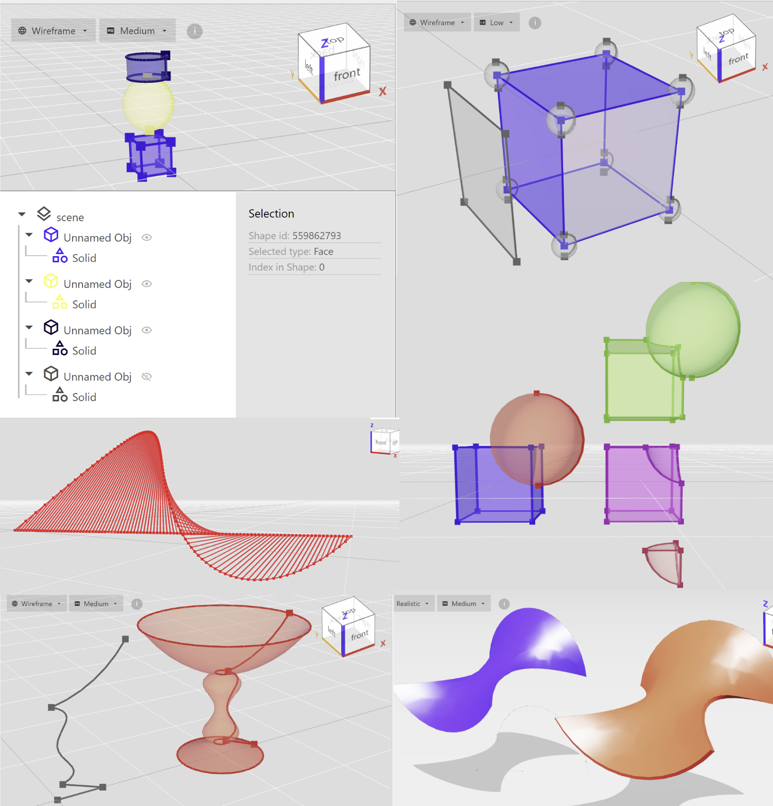

## What's in this section

1. 📖 [Model Terminology](/guide/modeling/terminology/)
2. 🏷 [Organize your Model](/guide/modeling/model-org/)
3. 👆 [Access parts of your model](/guide/modeling/model-access/)

3. Learn the different techniques of modeling:
* ✒️ [Topology modeling](/guide/modeling/topology/)
* 🍱 [Constructive Solid Geometry modeling](/guide/modeling/csg/)
* ✏️ [Sketching](/guide/modeling/sketching/)
* 📐 [Advanced surface modeling](/guide/modeling/surface/)
* 💣 [Misc](/guide/modeling/misc/)
