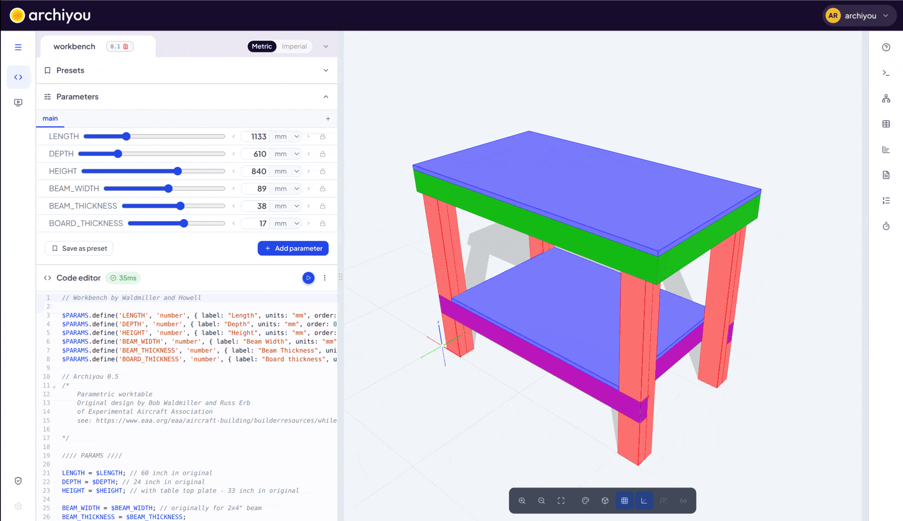
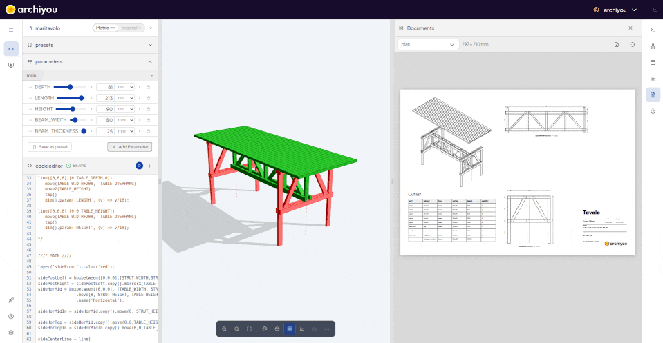

## Welcome to Archiyou

Archiyou turns a few lines of code into a 3D model, drawings and data. This short tour
shows where everything is. Use **Next** to go on, or close this panel at any time: you
can take the tour again from the **Tour** tab.

## Your scripts
<!-- highlight: file-menu -->

The menu at the top left creates, opens, shares and exports scripts. Scripts save
themselves, to your account or to this browser when you are not signed in.

## The script name
<!-- highlight: file-info -->

This is the script you are working on. Click the name to rename it.

## The code
<!-- highlight: code -->

Here you write your design. Every line builds or changes shapes, for example
`box(100, 50, 20)` makes a box of 100 by 50 by 20 mm.

## Run it
<!-- highlight: run -->

**Run** builds the model from your code. The shortcut is `Ctrl + Enter`
(`Cmd + Enter` on a Mac). When automatic running is on, the model also updates a moment
after you stop typing.

## The model
<!-- highlight: viewer -->

The result appears here. Drag to orbit, scroll to zoom, and right-drag to pan.
Click a shape to select it.

## Parameters
<!-- highlight: params -->

Numbers you want to change without touching the code become **parameters**: sliders and
fields that appear here. A published configurator shows exactly these controls to your
users.

## Tools
<!-- highlight: toolbar -->

The toolbar on the right opens tools next to the model: the console with messages and
errors, the scene tree, data tables, drawings and more.

## Where to go next
<!-- highlight: tool-help -->

This help panel stays one click away. Open **Tutorials** to build your first design
step by step, starting with a simple table.
