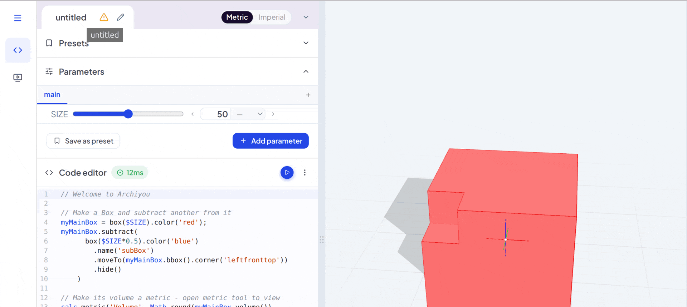
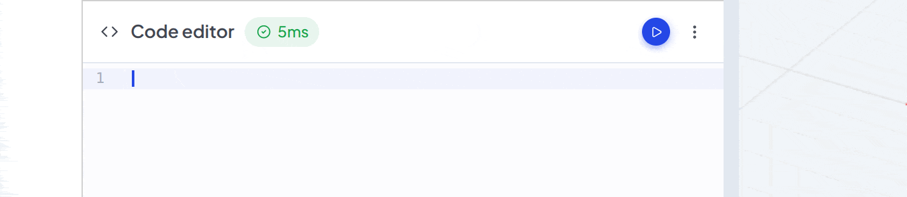
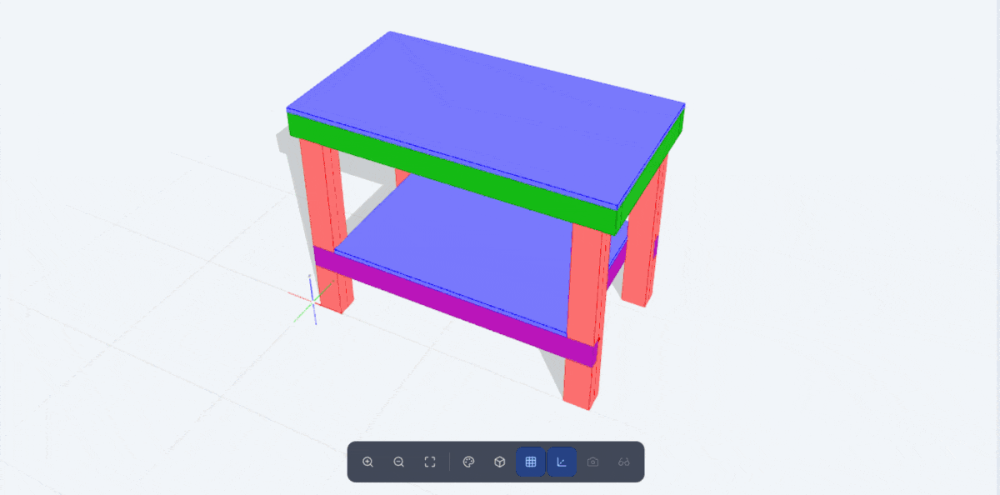
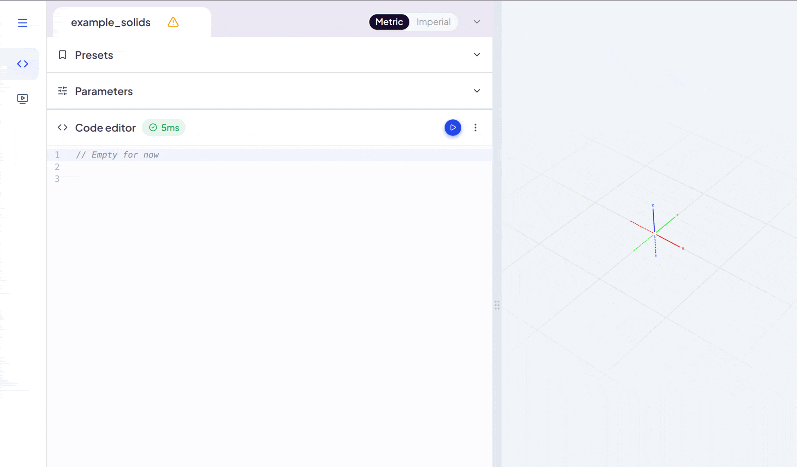
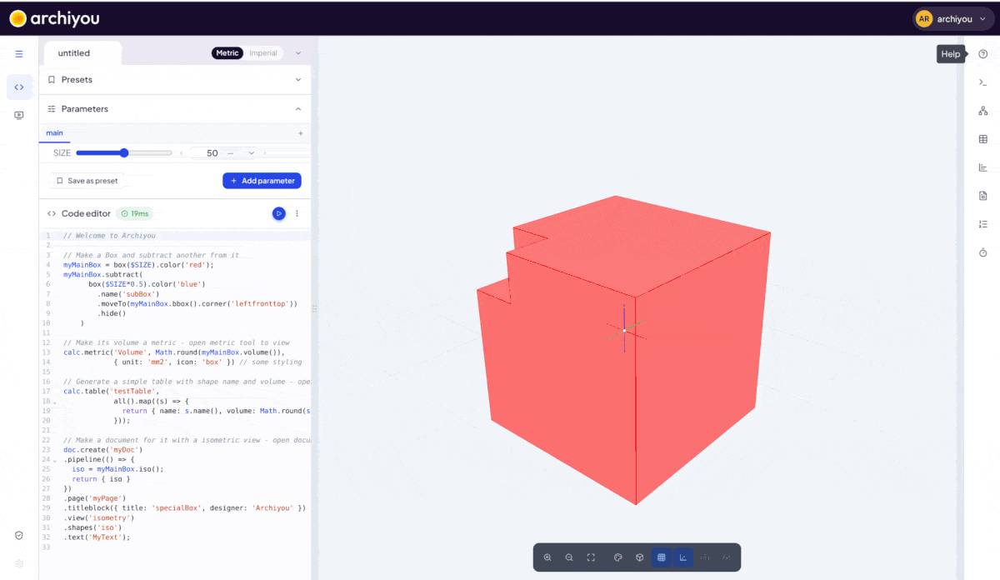
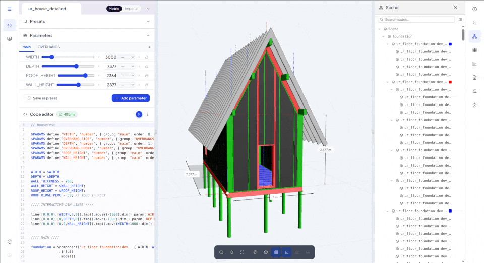

## Welcome to Archiyou

With Archiyou you can create and publish your parametic designs. With a simple scripting language you define a flexible 3D model as well its calculations, drawings and documentation.

## The Editor, File Menu and File Browser
<!-- highlight: file-menu -->

The main file menu (top left hamburg icon) gives you access to your scripts and export, share and publish them. From here you can also open the File Browser. 
But first let us explore the Editor.

## Script name and information
<!-- highlight: file-info -->

This is the script you are working on. Click the name to rename it and press the right down-arrow to show and edit more about it. Next to the name you find some important properties: like the version (if any) and if you have write access.

## The Code Editor
<!-- highlight: code -->

Here you write the code of your design and basically everything else too. Every line builds or changes shapes, for example
`box(100, 50, 20)` makes a box of 100 by 50 by 20 mm.

While typing you get suggestions of possibilities. You can also check the reference in the help tool bar (right top) to see what's possible.

## Execute your code
<!-- highlight: run -->

The **Execute** button builds the model from your code. **Automatic execute** option is on by default. Change it - along with other advanced options in the execution options menu **(⋮)**. 

Sometimes there is an error in your code, which is shown above the code. You can click on it to go the line. To fix it check the **Console** in the toolbar or consult the reference in the **Help tool**.

## The model in the Viewer
<!-- highlight: viewer -->

The result appears here. Drag to orbit, scroll to zoom, and right-drag to pan.
Click a shape to select it. In the bar below are options like isometric view, change view styles and auto-zoom. 

## Parameters
<!-- highlight: params -->

**Parameters** turn a static design into a flexible - interactive - one, by plugging values into the script that the user sets in sliders, options lists or text field. 

## Tools
<!-- highlight: toolbar -->

The **toolbar** on the right opens tools next to the model: the console with messages and
errors, the scene tree, data tables, drawings and more.

## Where to go next
<!-- highlight: tool-help -->

In the editor the help tool is always to the right top. If you want step-by-step introduction into practical things Archiyou can do for you, check out the **Tutorials** section in the help tool or [here in the general docs](/tutorials)  

If you want to see what's possible: Look at the shared scripts. 

