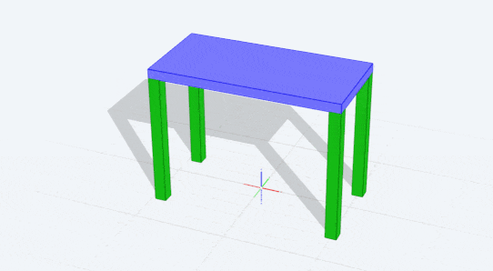
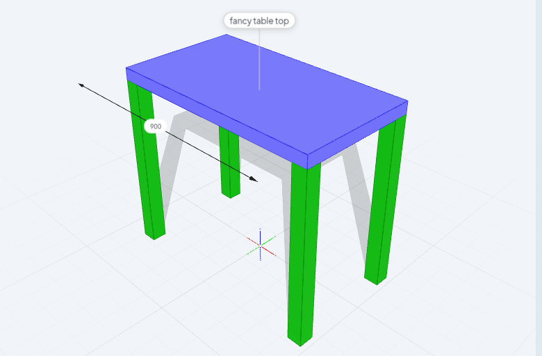
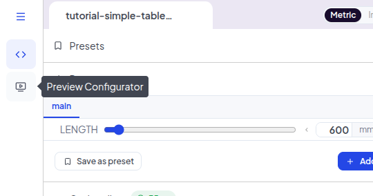
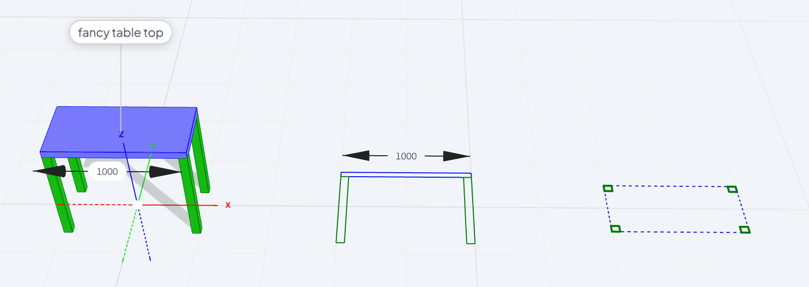
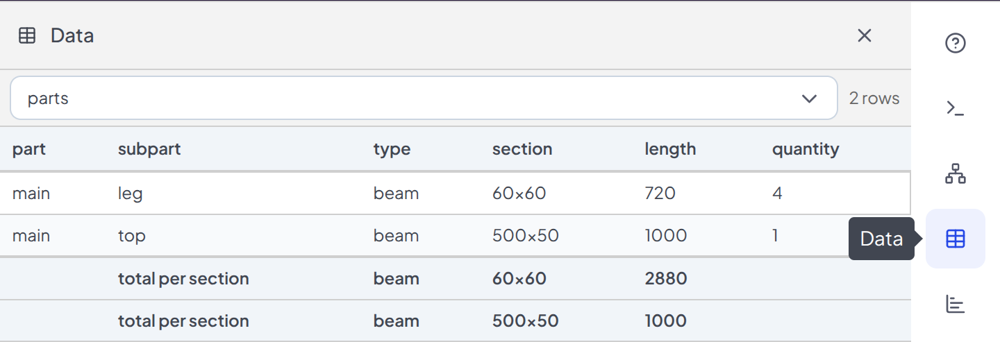
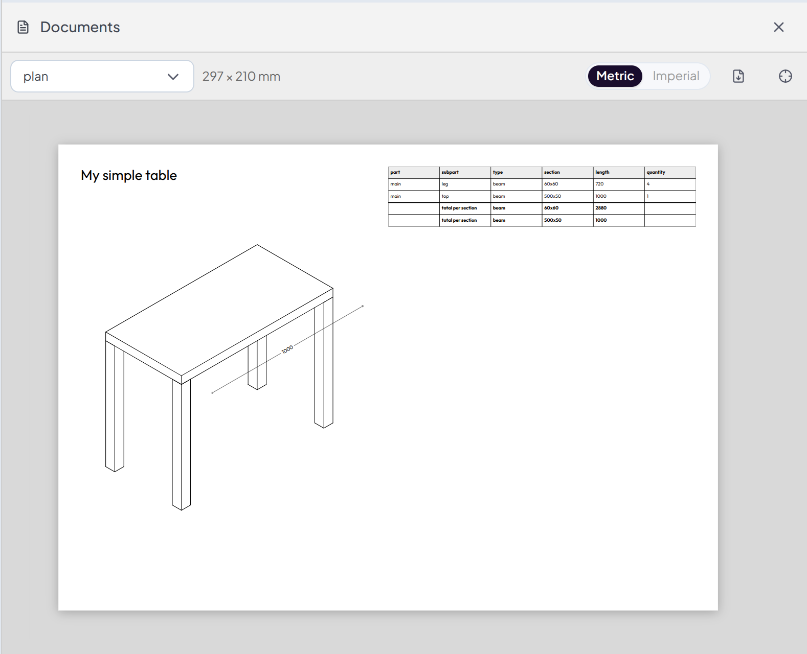
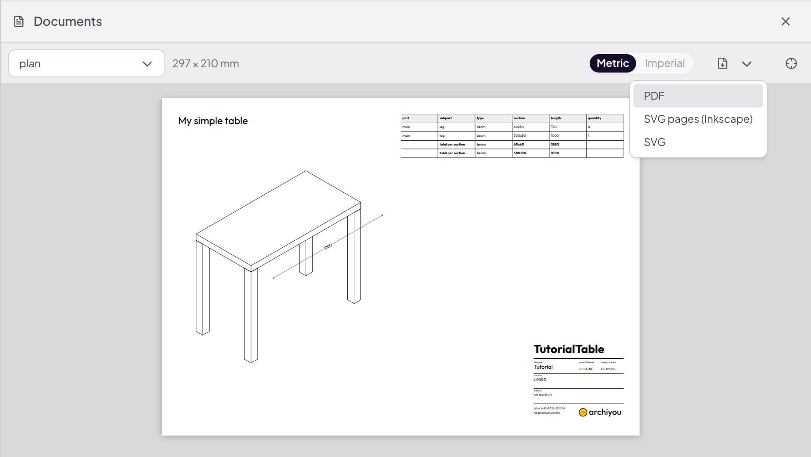

In [the first tutorial](./simple-table) we made this simple parametric table: 



## Where we left off

```js run
$PARAMS.define('LENGTH', 'number', 
                { label: 'Length', units: 'mm', 
                default: 1000, minimum: 500, 
                maximum: 2400, multipleOf: 10 
})

top = box($LENGTH, 500, 50)
            .moveZ(700)
            .color('blue')
            .name('top');

leg = box(60, 60, 720)
            .align(top, 'leftfronttop', 'leftfrontbottom')
            .color('green')
            .name('leg');

leg.copy().align(top, 'rightfronttop', 'rightfrontbottom');
leg.copy().align(top, 'leftbacktop', 'leftbackbottom');
leg.copy().align(top, 'rightbacktop', 'rightbackbottom');
```

Archiyou is not only about models: It's about offering it online for people to make. So let's make it more interactive and create some documentation for it. 

## Annotation and interaction

Let's make the parametric model easy to understand and interact with:

```js append
// A label
top.label('fancy table top', { offset: 100 })
// A dimension line
top.select('E||topfront')
        .dim({ offset: 200 })
        .param('LENGTH'); // bind it to the LENGTH param
```

You should see something like this:

 

With labels you can clarify your models. Like describing the table top. Dimension lines also tell something about your model: its dimensions. `top.select('E||topfront').dim();` creates a dimension line on the `topfront` edge of our top. By adding `.param('LENGTH')` to it you can make it interactive. Try clicking on the dimension line and typing a number!

To see how the interactive configurator would look for your script: click on the `Preview Configurator` icon on the left bar. 



## Documentation

Now let's create a document you can take into the workshop to actually produce this table. 

```js append
// isometric drawing of the table (moved out of the way from the model itself)
iso = all().iso().move($LENGTH*2);

// create a document called 'plan'
docs.create('plan')
    .text('My simple table') // place a simple text
    .view('iso') // a view into the model
    .shapes(iso) // onto the iso
    .width(0.5) // make the container half page width
```

Archiyou can make isometric drawings from your model: `iso = all().iso()`. By calling the utility function `all()` we get all shapes in our scene. Then the `iso()` method creates the isometry. By default it takes over the dimension lines too!

Now open the `Doc Tool` in the right bar and check out your plan!

:::tip[Elevations and sections]
Of course we have elevations and sections too. Try these out:
```js

elev = all().elevation('front').move(2000);

sect = all().section([0,0,300],[0,0,1]).move(2000);
sect.silhouette.dashed();
sect.cut.strokeWidth(2);
```

:::

## Advanced documentation

We think documentation is pretty important, and are constantly developing new methods. 
Here are some: 

### Part list 

Let's add this line above the `docs.create('plan')...` statement:

```js prepend

// Automatically generate a part list from box-like shapes in the scene
make.partList(); 

```

And open the *Data Tool* to see the part list:



## Data Tables

Now place the data table on the document:

```js append
    .table('parts')
    .width(0.5)
    .pivot('topright')
    .position('topright')
```

We also use some more positioning functions: `.pivot('topright')` places the pivot point - which is the place where to *grab* it - of the table in the top-right corner and `.position('topright')` places it in the top right. 

Open the *Doc Tool* to view your document with the data table:



## Titleblock

Let's wrap up with a nice titleblock:

```js append
    .titleblock({ title: 'TutorialTable', designer: 'Tutorial' });
```

You can export the document as PDF or SVG by clicking on the *File Export Icon*.



We support advanced pages export to the free and open-source software Inkscape.
