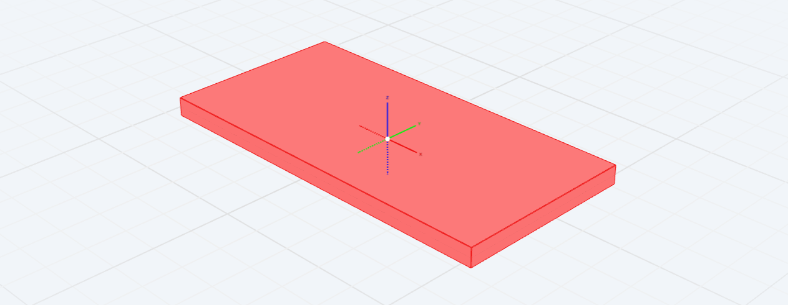
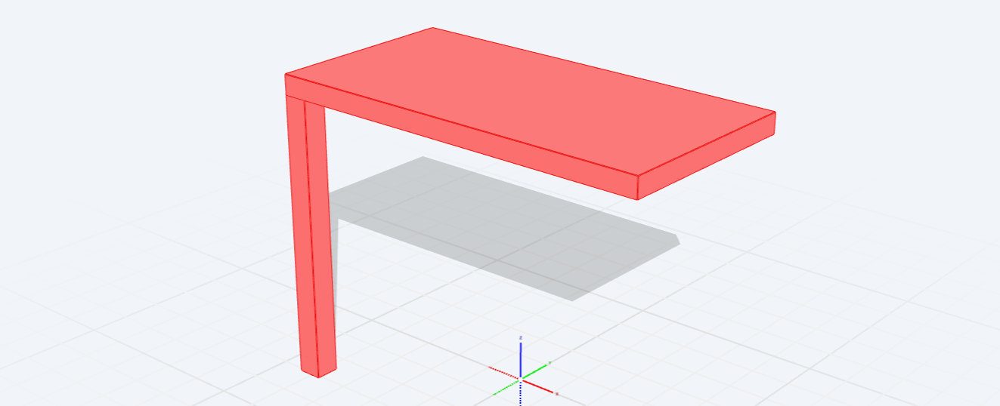
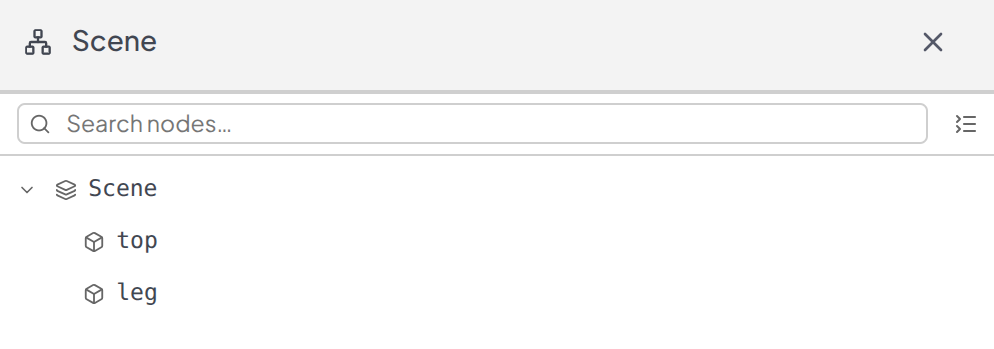
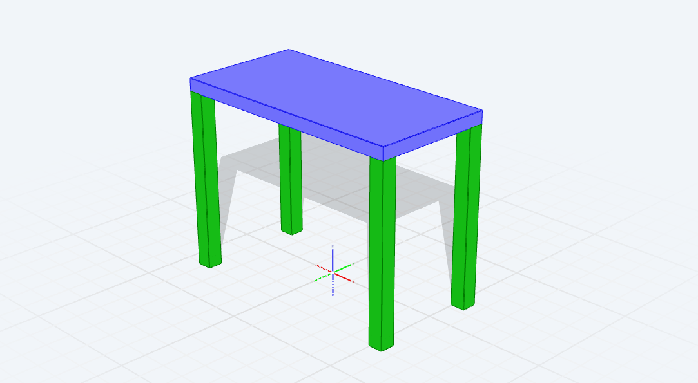
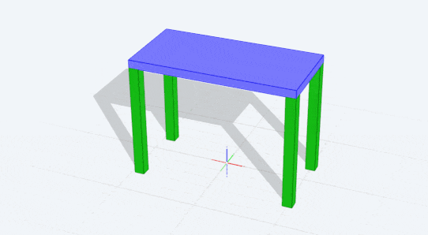
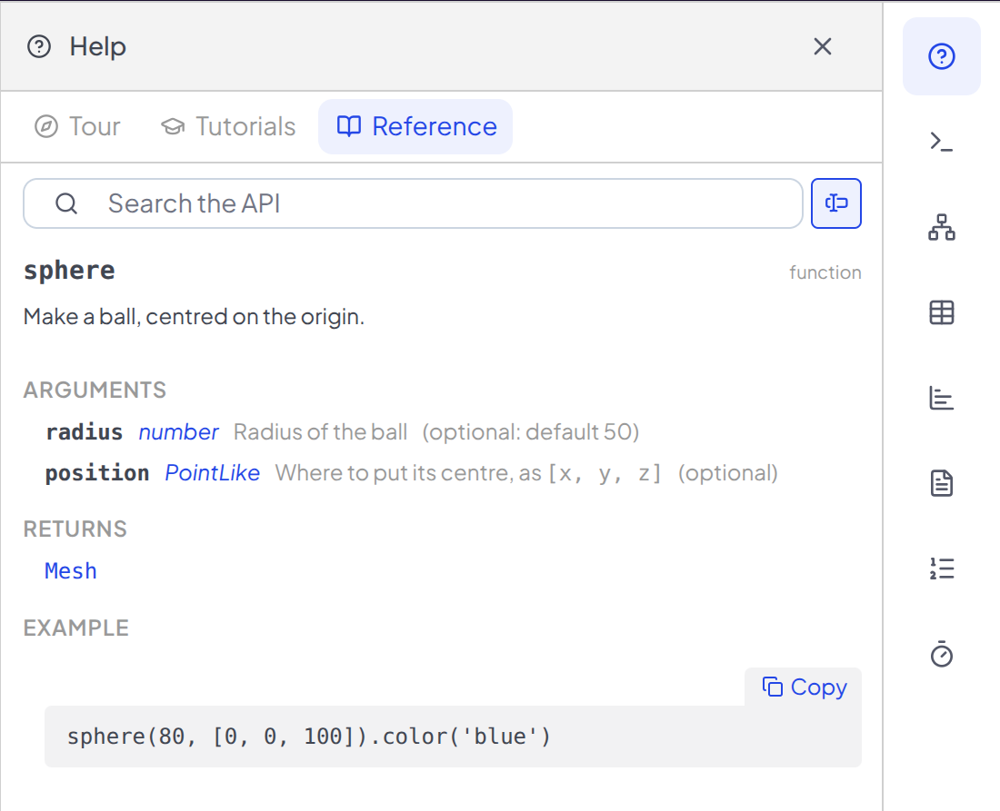

A basic table consists of five boxes: one top and four legs. It's also a great way to show you how Archiyou works. Let's dive in! 

<!-- docs-only -->
:::tip[Take the tutorial in the Editor]
You are on the docs website. If you like do an [interactive version of this tutorial in our editor](https://next.archiyou.com/editor?tutorial=simple-table).
:::
<!-- /docs-only -->

## Start with a box
<!-- highlight: code -->

The table top is a box of let's say 1000 mm long, 500 mm deep and 50 mm thick. Every size in
Archiyou is in millimetres unless you say otherwise.

```js run
top = box(1000, 500, 50);
```

`top` is a name for the box (a so called *variable*), so later statements can use it.

You will see this in your viewer:



## Lift the top
<!-- highlight: viewer -->

By default a box is placed directly center of the origin of the scene. Move it up to table
height with `moveZ`:

```js append
top.moveZ(700);
```

:::tip[A lot more transformations]
Transforming shapes can be done in numerous ways. Try out some of these to get a sense of what they do:
```
top.move(10,20,30); // move along three axis
top.rotateX(45); // rotate around shape center
top.rotateX(45, [0,0,0]); // rotate around origin of scene
// rotate back any shape to be parallel to axis
top.rotate(45,45).rotateToOrtho(); 
```
:::

## Add a leg

A leg is a tall thin box. Instead of calculating where it goes. Just `align` it: put the
leg's `left-front-top` corner on the top's `left-front-bottom` corner.

```js append
leg = box(60, 60, 720)
        .align(top, 'leftfronttop', 'leftfrontbottom');
```




## Colour and names

Give the parts a colour and a name. Names show up in the scene tree, in tables and in
drawings.

```js append
top.color('blue').name('top')
leg.color('green').name('leg')
```

:::tip[Change the color]
You can use any normal color name, like `green`, `brown` or `purple`. A hex value does work too `#FF0000` (red).
:::

Check the **Scene Navigator** (second top icon to the right) to your named shapes. Should look like this: 



## All four legs

Copy the leg and align each copy to another corner. A copy keeps the colour and the
name of the original.

```js append
leg.copy().align(top, 'rightfronttop', 'rightfrontbottom');
leg.copy().align(top, 'leftbacktop', 'leftbackbottom');
leg.copy().align(top, 'rightbacktop', 'rightbackbottom');
```



Our table is now always the same. Let's change that!


## Make it flexible
<!-- highlight: params -->

A table should fit the room. Define `LENGTH` as a parameter. 
This can be done in the **Parameter menu** or in the code itself. 

Here I added it in the code: `$PARAMS.define('LENGTH', 'number', { ... })`

Afterwards a slider appears, and the code reads its value as `$LENGTH`. Drag the slider and watch the table change length.

See if you can remove the `LENGTH` parameter and add it yourself.

```js run
$PARAMS.define('LENGTH', 'number', 
                { label: 'Length', units: 'mm', 
                default: 1000, minimum: 500, 
                maximum: 2400, multipleOf: 10 
})

top = box($LENGTH, 500, 50)
            .moveZ(700)
            .color('blue')
            .name('top');

leg = box(60, 60, 720)
            .align(top, 'leftfronttop', 'leftfrontbottom')
            .color('green')
            .name('leg');

leg.copy().align(top, 'rightfronttop', 'rightfrontbottom');
leg.copy().align(top, 'leftbacktop', 'leftbackbottom');
leg.copy().align(top, 'rightbacktop', 'rightbackbottom');

```




## That's it!...or is it?

You built a parametric table with boxes, `align` and one parameter. 

Here are some challenges:
* Can you make the width also interactive?
* How to change the size of the legs in the code?
* Can you make the legs cylinders instead of boxes?

But there is more! Check [More Simple Table: Interaction and documentation](./)

:::tip[Coding: What to type?]
Archiyou helps developers during typing:
* **Editor autosuggestions**: Just start typing `sph` and you'll get `sphere()`
* **Reference Auto Lookup**: In the *Help tool* click on *Reference*. Here you can search or just type and you get documentation belonging to that command. 


:::


